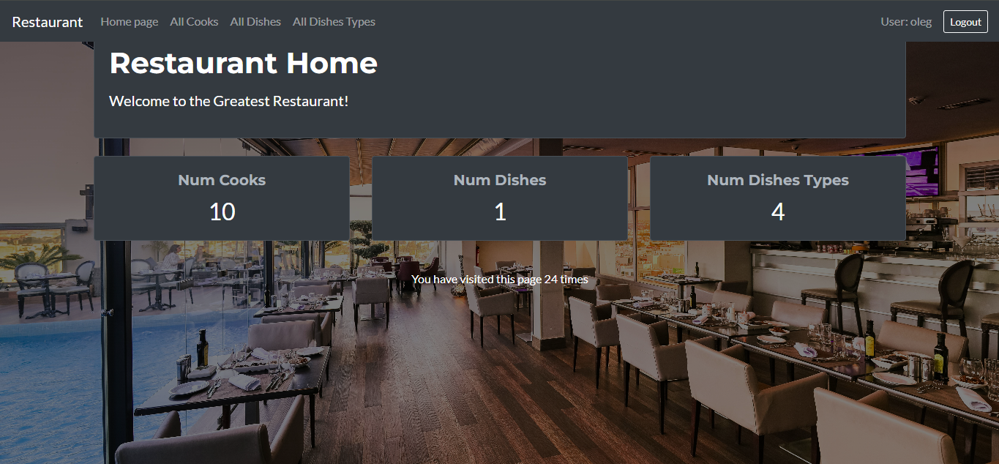

# Restaurant Service Project

Django project for managing dishes, dish types, and cooks in a restaurant.

## Check it out!  

[Restaurant project deployed to Render](https://restaurant-service-t6ff.onrender.com)
login: adminn
password: adminn

## Installation

Python 3 must be already installed.

```shell
git clone https://github.com/olegicks/restaurant-service.git
cd restaurant-service
python3 -m venv venv
source venv/bin/activate
pip install -r requirements.txt
python manage.py runserver  # starts Django Server
```

## Features
* Ability to add, update, or delete dishes and dish types.
* Managing cooks and their assigned dishes.
* Authentication system for users.
* User-friendly admin panel for advanced management.

## Demo
